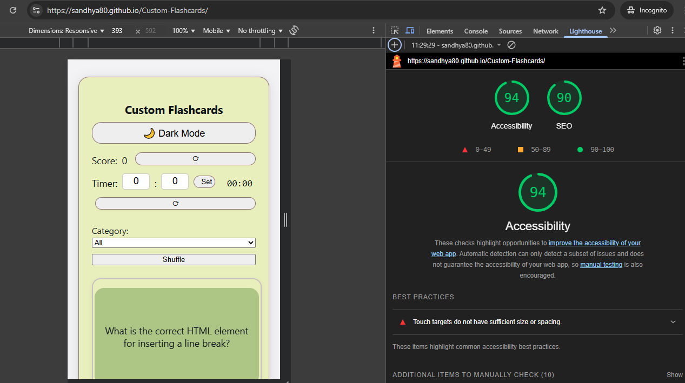
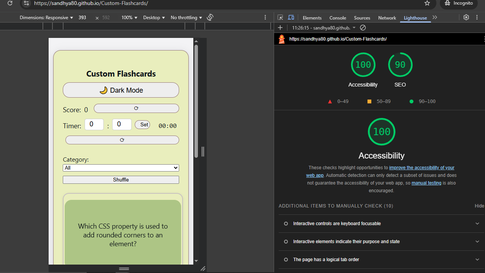
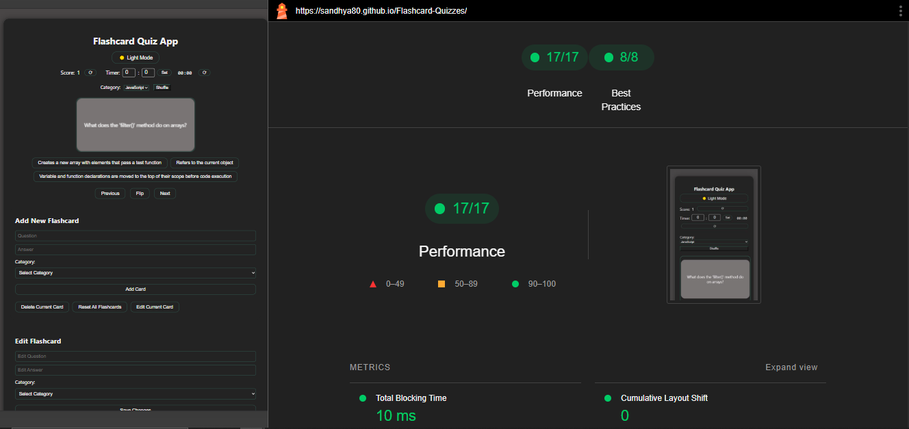

# Custom Flashcards

A modern, interactive flashcard app for learning JavaScript, HTML5, and CSS3. Features include multiple-choice quizzes, category filtering, a countdown timer, dark/light mode, and full mobile responsiveness with accessible color palettes.

---

## Table of Contents

- [Demo](#demo)
- [Deployed App](#deployed-app)
- [File Structure](#file-structure)
- [Accessibility and SEO](#accessibility-and-seo)
- [Performance and Best Practices](#performance-and-best-practices)
- [Color Palette](#color-palette)
- [Key Features](#key-features)
- [JavaScript Methodologies Used](#javascript-methodologies-used)
- [Getting Started](#getting-started)
- [User Instructions](#user-instructions)
- [Customization](#customization)
- [License](#license)
- [Contact](#contact)

---

## Demo


---

## Deployed App

You can try the Custom Flashcards live here:  
[https://sandhya80.github.io/Custom-Flashcards/](https://sandhya80.github.io/Custom-Flashcards/)

---

## File Structure

```plaintext
flashcard-quizzes/
├── index.html         # Main HTML file
├── style.css          # App styling
├── script.js          # App logic and interactivity
├── favicon.ico        # App icon 
└── README.md
```

---

## Accessibility and SEO

Flashcard Quizzes is built with accessibility and SEO best practices in mind:

- **Semantic HTML:**  
  Proper use of HTML5 semantic elements (`<header>`, `<nav>`, `<main>`, `<footer>`, etc.) to structure the content meaningfully.

- **ARIA Roles and Attributes:**  
  Appropriate ARIA roles and attributes are used to enhance accessibility for assistive technologies (e.g., `aria-live` for announcements, `role="button"` for clickable elements).

- **Keyboard Navigation:**  
  The app is fully navigable using a keyboard, with logical tab order and focus management.

- **Color Contrast:**  
  Text and interactive elements have sufficient colour contrast ratios to ensure readability for users with visual impairments.

- **Alt Text for Images:**  
  Descriptive alt text is provided for all meaningful images and icons.

- **Responsive Design:**  
  The layout adapts gracefully to different screen sizes and orientations, ensuring usability on mobile devices.

- **SEO-Friendly Structure:**  
  The HTML is structured to be crawlable and indexable by search engines, with proper use of headings, links, and metadata.

**Accessibility and SEO Test Results for Mobile and Desktop:**  

  


---

## Performance and Best Practices

To ensure fast load times and a smooth user experience, Flashcard Quizzes follows these performance and best practices:

- **Optimized Assets:**  
  Images and other assets are optimized for the web to reduce file size and improve loading speed.

- **Minified CSS and JavaScript:**  
  CSS and JavaScript files are minified to decrease their size and reduce the number of HTTP requests.

- **Browser Caching:**  
  Leveraging browser caching for static assets to improve repeat visit loading times.

- **Responsive Images:**  
  Using responsive image techniques (e.g., `srcset`) to serve appropriately sized images for different devices.

- **Accessibility Best Practices:**  
  Following WCAG 2.1 guidelines to ensure the app is accessible to users with disabilities.

- **SEO Best Practices:**  
  Implementing on-page SEO best practices, including meta tags, title tags, and structured data markup.

**Performance and Best Practices Test Results:**  



---

## Color Palette

The Flashcard Quizzes app uses a modern, accessible colour palette for both light and dark modes to ensure readability and a pleasant user experience.

| Purpose                | Light Mode         | Dark Mode         |
|------------------------|-------------------|-------------------|
| Background             | `#f3f3f5`         | `#232323`         |
| Container              | `#acb999`         | `#232323`         |
| Primary Text           | `#0d1418`         | `#f1f1f1`         |
| Accent/Border          | `#917474`         | `#444`            |
| Button/Highlight       | `#e2e8f0`         | `#444`            |
| Correct Answer         | `#b6e2a1`         | `#3a5d2c`         |
| Wrong Answer           | `#f7b2ad`         | `#a94442`         |

- All colours are chosen for high contrast and accessibility.
- The palette ensures the app is visually appealing and easy to use on all devices and in all lighting conditions.

---

## Key Features

- Multiple-choice flashcards for JavaScript, HTML5, and CSS3
- Add, edit, and delete flashcards
- **Enhanced Edit Flashcard:** Select a category, then choose a question from that category to edit, making editing faster and more organized
- Category filtering and card shuffling
- Score tracking with reset option
- **Countdown timer with set/reset and time-up alert**
- Responsive and modern UI (container is always 80% of viewport width)
- Data persistence with localStorage
- **Dark Mode / Light Mode toggle for comfortable viewing**
- **Modern, accessible colour palettes for both light and dark themes**
- Accessible and mobile-friendly design
- **Add/Edit Forms Hidden by Default:** The "Add New Flashcard" and "Edit Flashcard" forms are now hidden until the user clicks their respective buttons, keeping the interface clean and focused.

---

## JavaScript Methodologies Used

Flashcard Quizzes leverages modern JavaScript methodologies and best practices to ensure a robust, maintainable, and interactive user experience:

- **Modular Code Structure:**  
  Functions are organized by responsibility (rendering, event handling, data management) for clarity and maintainability.

- **DOM Manipulation:**  
  The app dynamically updates the DOM to display questions, choices, scores, and feedback using methods like `document.getElementById`, `createElement`, and event listeners.

- **Event-Driven Programming:**  
  User interactions (button clicks, form submissions, category changes) are handled using event listeners to provide real-time feedback and interactivity.

- **State Management:**  
  The app maintains state variables (such as current question, score, filtered cards, selected category, and timer) to track user progress and update the UI accordingly.

- **Local Storage:**  
  User data (flashcards and score) is persisted using `localStorage`, allowing users to retain their progress and custom cards across sessions.

- **Array Methods:**  
  Modern array methods like `.filter()`, `.map()`, `.forEach()`, and `.sort()` are used for efficient data manipulation (e.g., filtering by category, shuffling cards, generating choices).

- **Form Handling and Validation:**  
  Input forms for adding and editing flashcards include validation to ensure data integrity before updating the flashcard set.  
  **The edit flashcard form now features a category dropdown and a dynamic question dropdown, so users can quickly select and edit any flashcard by category and question.**
  **Both the Add and Edit forms are hidden by default and only shown when their respective buttons are clicked.**

- **Responsive Feedback:**  
  The UI provides immediate feedback for correct/incorrect answers, quiz completion, and score updates.

- **Progressive Enhancement:**  
  The app is designed to work seamlessly on all modern browsers and devices, with graceful fallbacks for unsupported features.

---

## Getting Started

1. **Clone the repository:**

   ```bash
   git clone https://github.com/yourusername/flashcard-quizzes.git
   cd flashcard-quizzes
   ```

2. **Open `index.html` in your browser.**

_No build steps or dependencies required._

---

## User Instructions

- **Answer Questions:** Click on the correct answer from the multiple choices.
- **Flip Card:** View the answer using the "Flip" button or wait till it flips automatically.
- **Navigate:** Use "Next" and "Previous" to move between cards.
- **Add/Edit/Delete:** Use the provided forms and buttons to manage flashcards.
- **Add/Edit Forms:** The "Add New Flashcard" and "Edit Flashcard" forms are hidden by default and only appear when their respective buttons are clicked.
- **Edit Flashcard:** In the edit section, first select a category, then choose a question from that category to edit its details.
- **Filter:** Select a category to focus on specific topics.
- **Shuffle:** Randomise the order of flashcards.
- **Score:** Track your score and reset it anytime.
- **Timer:** Set a countdown timer for your quiz session. When time is up, you'll get an alert.
- **Theme:** Use the toggle button to switch between Dark Mode and Light Mode.

---

## Customization

- **Add More Flashcards:** Edit `script.js` and add more questions/answers to the flashcards array.
- **Change Styles:** Modify `style.css` for custom colours and layout.
- **Expand Categories:** Add new categories and update the category dropdown in `index.html`.
- **Edit Flashcard Section:** The edit form now uses a category dropdown and a dynamic question dropdown for easier flashcard selection and editing.
- **Add/Edit Forms Visibility:** Both forms are hidden by default and only shown when their respective buttons are clicked.
- **Adjust Timer:** You can change the timer's default behaviour or alert in `script.js`.
- **Tweak Color Palettes:** Update the CSS variables or colour values in `style.css` for your preferred colour choices.

---

## License

This project is licensed under the MIT License.

---

## Contact

For questions, suggestions, or feedback, please contact:  
**Sandhya H**  
Email: [sandhyaharsh@gmail.com](mailto:sandhyaharsh@gmail.com)  
GitHub: [sandhya80](https://github.com/sandhya80)

---

Happy learning and enjoy practicing with your customized Flashcard Quizzes app!
